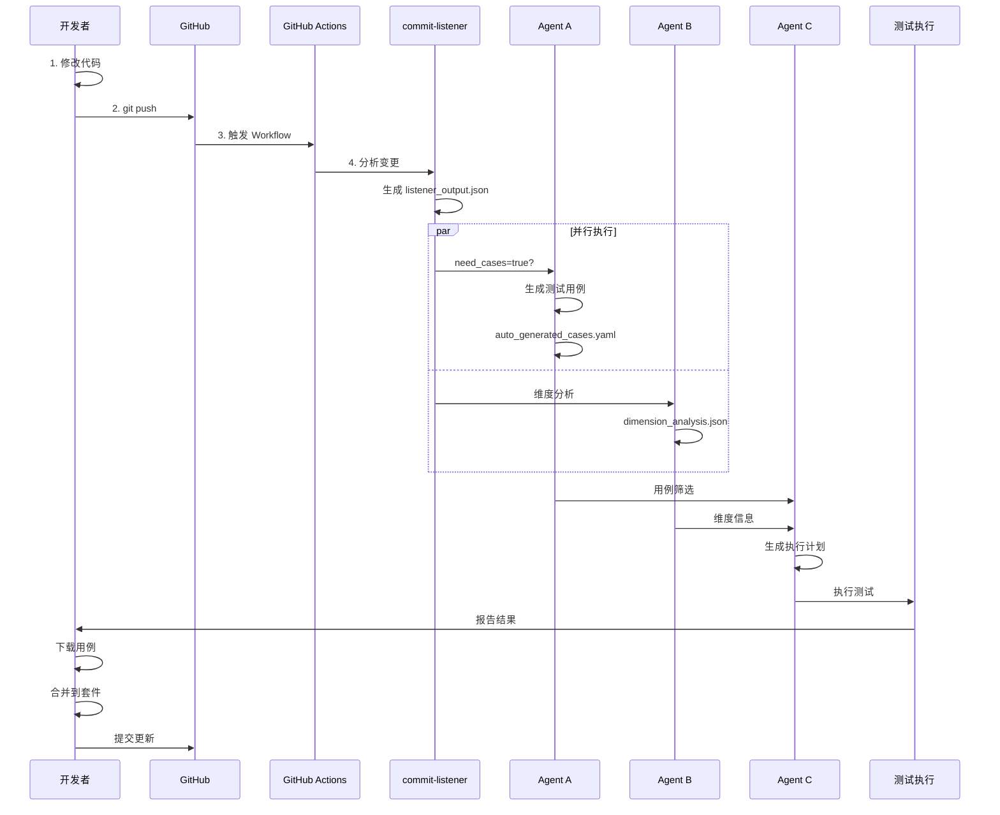

# 🎬 端到端流程演示文档

## 概述

本文档展示完整的**智能体驱动测试用例生成**流程：

```
代码修改 → Git Push → GitHub Actions → Agent A → 用例生成 → 本地合并 → Git Push
```

---

## 流程图



---

## 详细步骤

### 步骤 1: 修改代码

创建新的 API Controller：

```bash
# 创建新文件
cat > vega/data-connection/.../BatchDatasourceController.java << 'EOF'
package com.eisoo.dc.gateway.controller;

@RestController
@RequestMapping("/api/data-connection/v1/datasource")
public class BatchDatasourceController {
    
    @PostMapping("/batch-delete")
    public HttpResInfo batchDeleteDatasources(@RequestBody BatchDeleteRequest request) {
        return HttpResInfo.success();
    }
}
EOF
```

### 步骤 2: 提交代码

```bash
git add .
git commit -m "feat: add batch delete API"
git push origin main
```

### 步骤 3: 监控 GitHub Actions

Workflow 自动触发，访问：
- URL: `https://github.com/susan-meng/pipehome/actions`

Jobs 执行顺序：
1. ✅ **commit-listener** - 分析代码变更
2. ✅ **agent-a-maintenance** - 生成测试用例（如果 need_add_cases=true）
3. ✅ **agent-b-dimension** - 维度分析
4. ✅ **agent-c-selector** - 用例筛选
5. ⏭️ **run-tests** - 执行测试
6. ⏭️ **agent-d-report** - 生成报告

### 步骤 4: 下载生成的用例

```bash
# 获取 Run ID
RUN_ID=$(gh run list --limit 1 --json databaseId --jq '.[0].databaseId')

# 下载 Artifact
gh run download $RUN_ID --name agent-a-generated-$RUN_ID
```

### 步骤 5: 合并用例

```python
import yaml

# 读取生成的用例
with open('auto_generated_cases.yaml', 'r') as f:
    generated = yaml.safe_load(f)

# 按 URL 合并到对应套件
for case in generated['cases']:
    suite_file = url_to_suite[case['url']]
    # 追加到现有套件...
```

### 步骤 6: 提交合并结果

```bash
git add at-framework/testcase/vega/suites/
git commit -m "test: merge Agent A generated cases"
git push
```

---

## 触发条件

### Agent A 何时运行？

| 条件 | 值 | 结果 |
|------|-----|------|
| `has_changes` | true | ✅ 有代码变更 |
| `need_add_cases` | true | ✅ 需要新增用例 |

**满足条件的情况：**
- 新增 Controller 文件
- 新增 API 方法
- 修改 API 参数

**不满足条件的情况：**
- 修改 workflow 文件
- 修改文档
- 纯格式化变更

---

## 配置文件说明

### path_scope_mapping.yaml

定义代码路径与测试范围的映射：

```yaml
subsystems:
  - id: vega-data-connection
    name: VEGA数据连接
    path_patterns:
      - "vega/data-connection/**"
    scope_tags: [regression, data-connection]
```

### apis.yaml

定义 API 列表：

```yaml
- name: 新增数据源
  url: /api/data-connection/v1/datasource
  method: POST
```

---

## 自动化脚本

使用 `end_to_end_demo.sh` 一键执行：

```bash
bash end_to_end_demo.sh
```

脚本功能：
1. 自动创建示例代码
2. 提交并推送
3. 监控 Actions 运行
4. 下载生成用例
5. 合并到本地套件
6. 提交合并结果

---

## 常见问题

### Q1: Agent A 没有运行？

**检查：**
```bash
# 查看 listener_output.json
cat listener_output.json | jq '.need_add_cases'
```

**解决：**
- 确保修改的是 Java/Go 源代码
- 确保路径匹配 `path_scope_mapping.yaml`

### Q2: 如何查看生成的用例？

**方法 1:** 下载 Artifact
```bash
gh run download <run-id> --name agent-a-generated-<run-id>
```

**方法 2:** 查看日志
```bash
gh run view --job=<job-id> --log
```

### Q3: 用例合并冲突？

**检查重复：**
```python
existing_names = {c['name'] for c in suite['cases']}
if case['name'] not in existing_names:
    suite['cases'].append(case)
```

---

## 总结

完整流程时间线：

| 步骤 | 耗时 | 操作者 |
|------|------|--------|
| 代码修改 | 5 min | 开发者 |
| Git Push | 10 sec | 开发者 |
| Actions 运行 | 1-2 min | 自动 |
| 下载用例 | 10 sec | 开发者 |
| 合并用例 | 1 min | 自动/开发者 |
| Git Push | 10 sec | 开发者 |
| **总计** | **~8 min** | - |

---

## 相关链接

- GitHub Actions: https://github.com/susan-meng/pipehome/actions
- 配置文件: `at-framework/testcase/vega/_config/`
- 测试套件: `at-framework/testcase/vega/suites/`
- 自动化脚本: `end_to_end_demo.sh`
